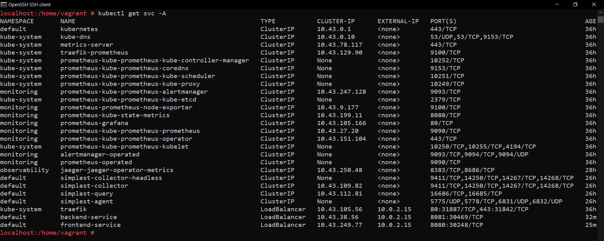
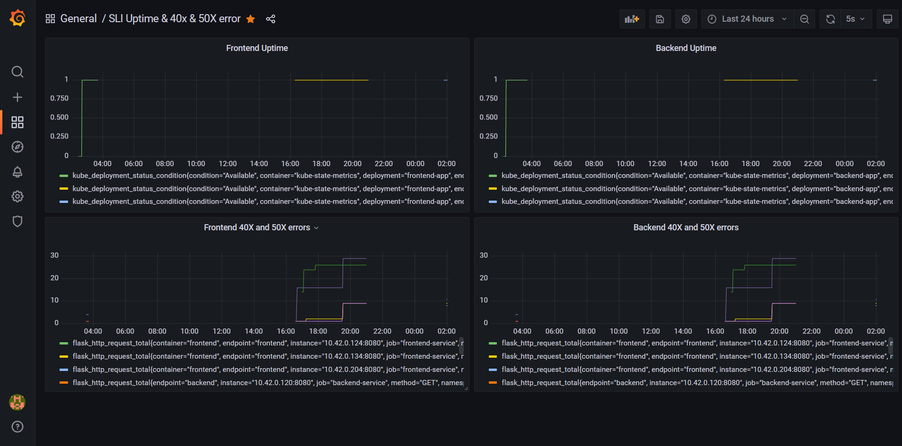

## Verify the monitoring installation



## Setup the Jaeger and Prometheus source


## Create a Basic Dashboard


## Describe SLO/SLI
Describe, in your own words, what the SLIs are, based on an SLO of *monthly uptime* and *request response time*. ?

The SLI for *monthly uptime* would be 99.5% monthly uptime. And for *request response time* would be response time below 5 sec per request.

## Creating SLI metrics.
It is important to know why we want to measure certain metrics for our customers. Describe in detail 5 metrics to measure these SLIs. 

1. Time Taken for a request to respond.
2. The number of failed requests.
3. The number of requests over a period of time.
4. CPU and Memory utilization by the service.
5. Fronted & Backend service uptime.

## Create a Dashboard to measure our SLIs


## Tracing our Flask App


## Jaeger in Dashboards


## Report Error

TROUBLE TICKET

```
Name: POST Request to `localhost:8081/star` gives 500 error

Date: 03-12-2021

Subject: Upon sending a POST request to Backend API star endpoint i.e `localhost:8081/star` with payload is failing with 500 error

Affected Area: Backend API /star endpoint

Severity: 1

Description: MongoDB instance is not set up properly which is causing the 500 
error
```


## Creating SLIs and SLOs
We want to create an SLO guaranteeing that our application has a 99.95% uptime per month. Name four SLIs that you would use to measure the success of this SLO.

1. Latency
2. Error
3. Traffic
4. Saturation

## Building KPIs for our plan
Now that we have our SLIs and SLOs, create a list of 2-3 KPIs to accurately measure these metrics as well as a description of why those KPIs were chosen. We will make a dashboard for this, but first, write them down here.

1. Latency:

    * Frontend and Backend Service Uptime
    * Average time is taken to send a response

2. Error:

    * Total number of 40x & 50x errors in Frontend
    * Total number of 40x & 50x errors in Backend

3. Traffic:

    * Number of requests over 30s
    * Number of requests with 200 responses over 30s

4. Saturation:

    * CPU usage by the Frontend & Backend.
    * Memory usage by the Frontend & Backend.

## Final Dashboard


Note: Description in the Grafana Dashboard